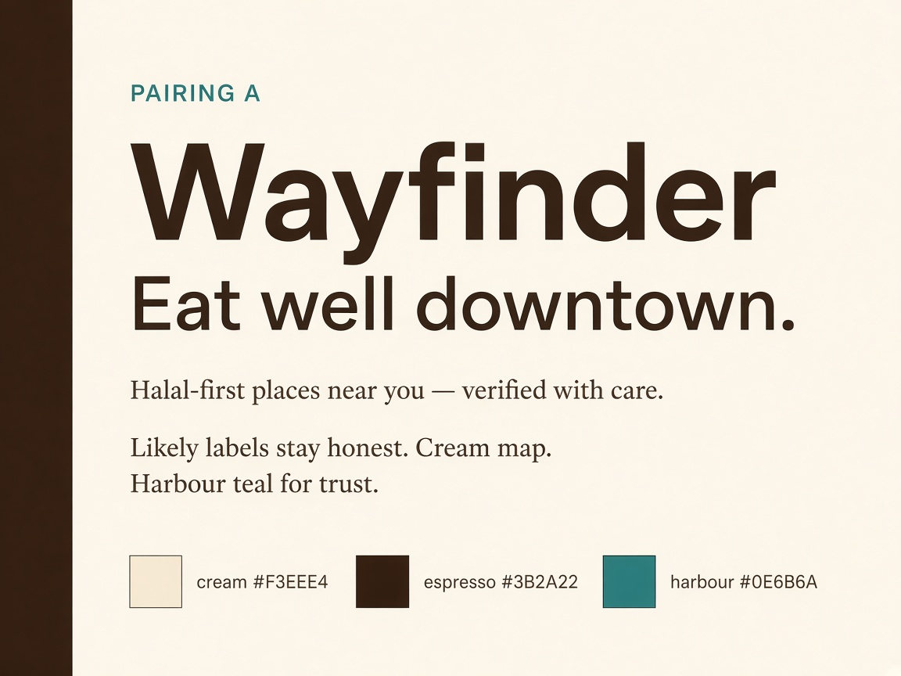
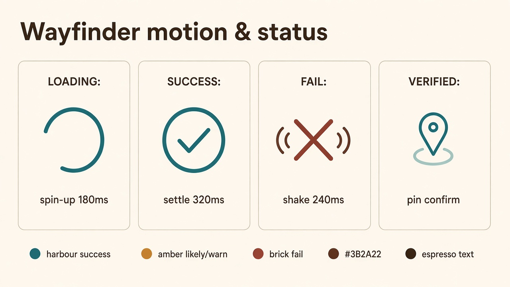
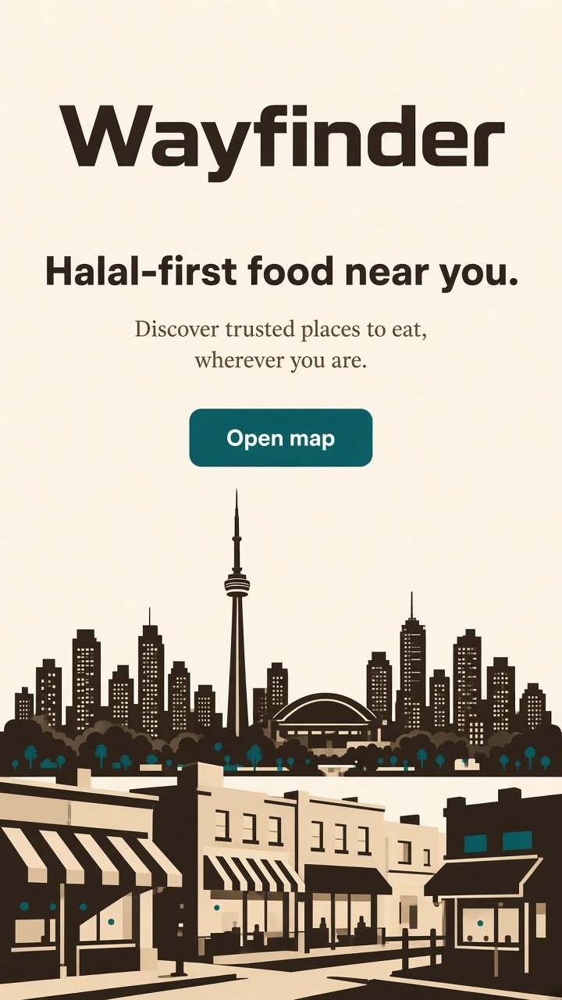

# Wayfinder Design System — Frontend

Approved direction from product brainstorming: **mobile map first**, bold Toronto landing to app, desktop secondary. Visual language: **urban + local** (downtown weight, still "home"). **Approach 1** palette (cream canvas, brighter espresso, harbour teal). **Type pairing A:** Syne + Source Serif 4. Motion is first-class (load, success, fail, spin-up).

This doc also applies `design-taste-frontend` (anti-slop frontend skill) to the **landing page** surface and defends every non-default choice against its checklist. The **map app itself is out of that skill's scope** (Section 13: dense product UI / dashboards are excluded); it still borrows the skill's accessibility and motion-honesty rules by extension.

Related product docs: [Overview](../product/outline.md) · [Search providers](../features/search.md) · [Trust copy](./trust-and-disclaimer-copy.md)

---

## 0. Design read (skill Section 0.B)

> Reading this as: **consumer utility landing + light map app**, for **restriction-aware eaters in a downtown/campus radius**, with an **urban-but-homey** language, leaning toward **native Tailwind + Motion, no packaged design system** (aesthetic, not an off-the-shelf kit).

Quiet constraint that overrides pure aesthetic preference (skill Section 0.A.6): this is **trust-first** for dietary/halal decisions, so the map surface stays calm and legible even where the landing gets bold.

## 1. Dials (skill Section 1)

| Surface | VARIANCE | MOTION | DENSITY | Rationale |
|---|---|---|---|---|
| Landing (mobile hero) | **7** | **6** | **3** | "Premium consumer / brand" preset, one notch of restraint since trust matters downstream |
| Map app (light UI) | **4** | **3** | **4** | Trust-first override (skill: trust-first/regulated/accessibility-critical -> 3-4 / 2-3 / 4-5); status legibility beats flourish |

Landing is allowed to be louder than the app it opens into. This is a deliberate split, not an inconsistency: the skill's dial table has separate presets per surface, and ours reads "landing = premium consumer," "map = trust-first."

## 2. Design system choice (skill Section 2)

No official package fits (this isn't Fluent/Material/Carbon/Polaris/GOV.UK territory). Per **Section 2.B**, this is an **aesthetic**, built with:

- **Tailwind v4** utilities for layout/spacing
- **Motion** (`motion/react`) for the small set of named motions in Section 4
- Native CSS `@media (prefers-reduced-motion)` / `(prefers-color-scheme)` for accessibility gates

No GSAP/scroll-hijack patterns are used; the landing has no pinned scroll sections, so Sections 5.A/5.B (sticky-stack, horizontal-pan) do not apply.

---

## 3. Color (Approach 1 — locked, defended)

| Token | Hex | Use |
|---|---|---|
| `--cream` | `#F3EEE4` | Page + map wash |
| `--cream-deep` | `#E7E0D4` | Sheets, panels, skeleton |
| `--espresso` | `#3B2A22` | Headlines, nav, icons (brighter roast, not near-black) |
| `--espresso-soft` | `#5C4A40` | Secondary text |
| `--harbour` | `#0E6B6A` | **The one accent** (skill 4.2): primary CTA, Verified, success, spinner head |
| `--harbour-bright` | `#1A8F8C` | Hover / focus / active pin |
| `--warn` | `#B8892A` | Likely badge (semantic status, not decoration) |
| `--danger` | `#8B3A2F` | Fail, False / not-halal (semantic status) |
| `--line` | `#D4CBBE` | Hairlines on cream |
| `--on-harbour` | `#F3EEE4` | Text on teal buttons |

### 3.1 Defense against the Premium-Consumer Palette Ban (skill Section 4.2)

The skill explicitly bans, **as a default**, warm cream backgrounds (`#f5f1ea`, `#efeae0`...) paired with brass/clay/ochre accents (`#b08947`, `#9c6e2a`...) and espresso near-black text (`#1a1714`...) for premium-consumer briefs, because every AI-generated "artisan" brand reaches for it and becomes invisible.

Our cream (`#F3EEE4`) and warn/amber (`#B8892A`) sit in that same family by construction. Two things keep this defensible rather than accidental:

1. **The override condition is met.** The skill permits the family "when the brand brief explicitly names those colors." The user explicitly requested brown ("brown should be up for consideration"), then explicitly locked cream as the map/landing field and espresso as the brown family, before any code was written. This was not the model defaulting to it unprompted, it was a directed brief.
2. **The single locked accent is outside the banned family.** Per the skill's Color Consistency Lock, one accent color is used identically everywhere: **harbour teal** (`#0E6B6A`), a saturated cool teal, not brass/clay/oxblood/ochre. It reads closer to the skill's own suggested alternative ("Cobalt + Cream: saturated blue against a single neutral, no brass") than to the banned artisan palette. The amber (`--warn`) and brick (`--danger`) are not the brand accent; they are a **semantic status pair** (Likely / False), the same category the skill explicitly allows for "real semantic state" dots and badges, used sparingly and never as CTA color.

**Rule enforced everywhere:** `--warn` and `--danger` never appear on a primary CTA. `--harbour` never appears on a Likely/False badge. This is what stops the palette from reading as generic "AI artisan brand" despite sharing a family with it.

### 3.2 Color Consistency Lock (skill Section 4.2) and Shape Consistency Lock (skill Section 4.4)

- One accent (`--harbour`) across landing and app; no page/section swaps it for a second color.
- One corner-radius system: buttons full-pill, cards/sheets 16px, inputs 8px, documented once here, followed everywhere.
- No pure `#000000` / `#ffffff` (skill 8.B): espresso and cream are both off-black/off-white by design already.

---

## 4. Typography (Pairing A — locked, defended)

| Role | Family | Notes |
|---|---|---|
| Display / brand / map chrome titles | **Syne** | Sans-serif display, per skill default |
| Body / disclaimers / serif moments | **Source Serif 4** | Small-role body serif only |
| UI fallback | Syne Medium/Regular, smaller sizes | One grotesk for chrome |

### 4.1 Defense against Serif Discipline (skill Section 4.1)

The skill is blunt: serif is "very discouraged as the default," and explicitly bans **Fraunces** and **Instrument Serif** as reflexive AI display-serif picks. Two things keep Source Serif 4 compliant rather than a violation:

1. **It is not a display font here.** Per the skill's own guidance ("default sans-serif display... Sans display fonts are not boring"), the display role stays **Syne**, a sans grotesk. Source Serif 4 is scoped to body copy and trust disclaimers only, the "warm readable body" role, not the brand-defining headline.
2. **It is neither banned name.** It is not Fraunces or Instrument Serif, the two specifically named LLM defaults, and the brief genuinely fits the "warm/home, not purely tech" aesthetic family the skill allows serif for in body contexts.

**Emphasis rule (skill 4.1):** within a Syne headline, emphasis uses italic/bold **Syne**, never a serif word dropped into a sans headline.

### Specimen

---

## 5. Motion & feedback (locked, defended)

### 5.1 "Motion must be motivated" (skill Section 5)

Every named motion below is justified by one of the skill's four valid reasons (hierarchy, storytelling, feedback, state transition). None exist "because it looked cool."

| Motion | Reason (skill category) | Why |
|---|---|---|
| `spinUp` | Feedback | Confirms the system registered the request before content exists |
| `pinEnter` | Hierarchy + storytelling | Staggered pins read as "results arriving," not a layout jump |
| `sheetUp` | State transition | Communicates "you moved from list to detail," not a modal swap |
| `landingExit` | State transition | Marks the hand-off from marketing surface to the actual product |
| `successSettle` | Feedback | Acknowledges a completed user action (save/confirm) |
| `failShake` | Feedback | Signals rejection distinctly from success, without new copy alone |
| `verifiedPulse` | Hierarchy | Draws the eye to the one badge that means "certified," once, not looping |

No infinite loops, no parallax, no scroll-hijack: MOTION_INTENSITY 6 (landing) / 3 (map) per the dial table stays in the "Fluid CSS" band (skill Section 7), not "Advanced Choreography." That is a deliberate ceiling, not an oversight, because looping motion on a Verified badge would cheapen the one signal that must feel certain.

### 5.2 Principles

- Enter: `cubic-bezier(0.22, 1, 0.36, 1)` · Exit: `cubic-bezier(0.4, 0, 1, 1)`.
- Durations: micro `120-180ms` · UI `240-320ms` · page `400-520ms` · map settle <= `600ms`.
- **Reduced motion is mandatory** (skill Section 6.B, non-negotiable above intensity 3): every motion below degrades to a crossfade or static icon under `prefers-reduced-motion`. Arcs, shakes, and pulses are the first things cut.

### 5.3 Feedback colors
Success / Verified / progress -> `--harbour`. Likely / soft warn -> `--warn`. Fail / False -> `--danger`. Neutral system -> `--espresso-soft` on cream.

### 5.4 Loading
1. **Cold start / landing to map**: cream full-bleed; espresso wordmark; harbour arc spinner (`spinUp`). Optional caption: "Finding places near you."
2. **Map hydrate**: pins `pinEnter` stagger 40ms, capped at 12 concurrent; skeletons on `--cream-deep`, opacity-only shimmer, 1.2s.
3. **Search / NL in flight**: compact harbour arc inside the search field; results don't reflow until they commit.
4. **Slow (>3s)**: calm caption under the spinner; teal stays until a hard fail.

### 5.5 Success
- `successSettle`: harbour check, scale `0.8 -> 1.05 -> 1` over 320ms.
- `verifiedPulse`: **one** ring on the pin/badge, 400ms. Likely gets a fade-in only, no pulse, so it never reads as certified.
- Toast: cream sheet, espresso text, harbour icon; slide up 240ms, hold, exit 180ms.

### 5.6 Failure
- `failShake`: 240ms, about 6px, three oscillations, plus a brick icon.
- Retry is a harbour **outline** button, not a second red control.
- Empty filter state: no shake, calm copy from the trust doc, no failure framing for "nothing matched yet."

### Motion board

---

## 6. Landing (mobile-first, skill-audited)

**Job of the first viewport:** brand wordmark, one headline, one short line, one CTA, one full-bleed Toronto graphic. Nothing else.

### 6.1 Hero hard-rule audit (skill Section 4.7)
- Headline: "Halal-first food near you." (1 line, well under the 2-line cap).
- Subtext: 1 short line, well under 20 words / 4 lines.
- CTA visible without scrolling; single primary CTA, "Open map," no secondary CTA competing for the same intent.
- Hero stack: brand wordmark + headline + subtext + CTA = **4 elements**, at the stack's own cap. No tagline under the CTA, no trust micro-strip, no version badge.
- Top padding stays within the `pt-24` cap; the hero graphic is full-bleed under the type, not floating in empty space.

### 6.2 Visual asset (skill Section 4.8)
The Toronto skyline/street-food illustration is produced via image-generation tooling (not a stock photo, not a div-based fake screenshot), per the skill's priority order: gen-tool first. It sits edge-to-edge as part of the hero plane, not an inset card.

### 6.3 Composition
- Background: `--cream`, shared with the map so the hand-off feels continuous, not like two different products.
- Type: Syne brand + headline; Source Serif 4 for the one support line only.
- CTA: `--harbour` fill, white (`--on-harbour`) label, triggers `landingExit`.
- Desktop: same story, wider hero; the map stays the product, this is not a desktop-first redesign.

### Landing specimen

---

## 7. Map app chrome (out of skill scope, kept consistent)

- Light cream map wash; espresso controls; harbour for the selected pin and Verified state.
- Status badges follow [trust copy](./trust-and-disclaimer-copy.md): Verified (teal), Likely (amber, quieter), Unchecked / False as specified there.
- Place detail: `sheetUp` cream sheet; Zabihah attribution in Source Serif / soft espresso.
- Sheets and pins are the containers; card-heavy UI is avoided per skill 4.4 ("cards only when elevation communicates real hierarchy").

---

## 8. Copy & content rules (skill Sections 9.D, 9.F, 9.G)

- **Zero em-dashes** in any UI-authored string (headlines, badges, buttons, toasts, empty states). Verbatim third-party strings (Zabihah's required attribution line) are the sole exception; see [trust copy](./trust-and-disclaimer-copy.md).
- No invented "startup-slop" stat strips, version badges (`BETA`, `v0.x`), or scroll cues on the landing hero.
- No generic placeholder names/avatars if example content is ever shown in marketing screenshots.
- One eyebrow maximum across the whole landing (it currently has zero; the wordmark itself is the identifier).

---

## 9. Implementation notes

- CSS variables named as in Section 3; dark theme is **out of scope** for the map in v1 (light-only is the trust-first override, not an oversight, see Section 0).
- Fonts: self-host or `next/font`, never a runtime `<link>` to Google Fonts in production (skill Section 3.A). Document licenses when added to the app repo.
- Wire the named motions from Section 5 in a single `motion.ts` / CSS `@keyframes` module; no ad-hoc animation definitions elsewhere.
- QA before shipping: reduced-motion path, contrast for espresso-on-cream and on-harbour text (WCAG AA, skill 4.5), no CTA label wraps to two lines at any tested width.

---

## 10. Open for later (not blocking this spec)

- Exact map pin SVG set (icon library choice: Phosphor or Tabler, one family only, per skill 3.C).
- Illustration art direction file for the Toronto hero (iterating the generated specimen into final asset).
- Desktop nav breakpoints beyond "secondary."

---

## Changelog
- 2026-09-09: Initial lock, palette Approach 1 (brighter espresso `#3B2A22`), type A, motion pack, landing summary.
- 2026-09-09: Expanded with `design-taste-frontend` audit: dial values, palette/serif/motion defenses, hero hard-rule check, em-dash copy audit. Moved from `docs/superpowers/specs/` into `docs/frontend/` as part of the docs reorg.
